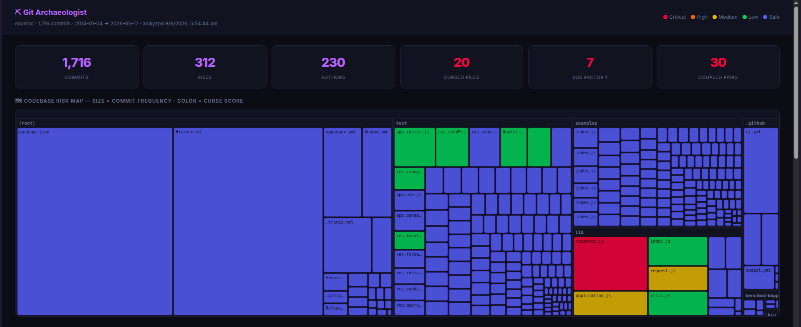

# git-archaeologist

[](https://www.npmjs.com/package/git-archaeologist) [](LICENSE) [](https://nodejs.org)

**Find out who actually owns your code, and whether that's still true.**

git-archaeologist reads your git history and tells you which parts of your codebase are concentrated in one person's hands — and, critically, whether that person is still around. A directory that's 70% owned by someone who committed last week is a completely different situation than one that's 70% owned by someone who hasn't committed in two years. Most ownership tools can't tell you which one you're looking at. This one can.

[Quick Start](#quick-start) · [Concepts](#concepts) · [Commands](#commands) · [Research](RESEARCH.md) · [Benchmarks](BENCHMARKS.md)

---

## Quick Start

```bash
npx git-archaeologist risk .
```

Works on any git repository. No install required.

## Example output

```
$ npx git-archaeologist risk .

⛏  git-arch risk — express
Maintenance risk map — not an ownership leaderboard
──────────────────────────────────────────────────────────────────────
HIGH RISK
lib
Bus Factor: 1   Ownership Concentration: 100%   Contributors: 12   Files: 24
Owner: Douglas Christopher Wilson   Last active: 14 months ago
Reason: Single dominant maintainer (Douglas Christopher Wilson) with limited contributor
redundancy. Dominant owner last committed 14 months ago.

MEDIUM RISK
api
Bus Factor: 1   Ownership Concentration: 65.3%   Contributors: 9   Files: 31
Owner: Douglas Christopher Wilson   Last active: 6 days ago
Reason: Ownership concentrated in Douglas Christopher Wilson, but other contributors exist.
```

## Why ownership concentration alone is misleading

We ran `git-arch risk` on two well-known projects and found nearly identical ownership numbers — with completely different stories underneath.

**Express.js — `lib/`**
- 65.3% of changes attributed to one long-time contributor
- 91 contributors total
- That contributor hasn't committed anywhere in the repo for **2 years**
- In the last 6 months, 5 different people made exactly 1 commit each — no clear successor

**Vue 3 — `packages/`**
- 70.7% of changes attributed to Evan You
- 384 contributors total
- Evan You committed **4 months ago**

Same concentration, roughly 65–70%. One has had no single contributor with sustained recent involvement; the other has its original dominant contributor still actively committing. The number alone can't tell you which — that's why `git-arch risk` reports **Ownership Concentration** and **Owner Activity** together.

## Concepts

**Ownership Concentration** — percent of a folder's commits from its biggest contributor. High isn't inherently bad on its own.

**Bus Factor** — computed per-folder, not per-repo. A repo-wide bus factor of 5 means nothing if your most critical module is bus factor 1.

**Owner Activity** — when did that dominant contributor last commit anywhere in the repo? This is what separates Express `lib/` (65%, owner gone 2 years) from Vue 3 `packages/` (70%, owner active 4 months ago).

**HIGH / MEDIUM / LOW** — concentration + bus factor + activity combined. HIGH means one inactive owner with little redundancy. Run `--all` to see every scope.

## Known limitations

- Commit authorship ≠ knowledge ownership. Someone can deeply understand code they rarely commit to.
- **Owner Activity Status helps here** — but it only sees commits, not reviews, PR approvals, or informal triage.
- Squash merges can distort concentration scores.
- PR reviewers and approvers are not currently considered (see Roadmap).
- Git history is one signal among several — use it as a starting point for questions, not a final verdict.

## Install

For repeated use:

```bash
npm install -g git-archaeologist
```

## Commands

```bash
git-arch risk /path/to/repo                    # ownership/maintenance risk map (start here)
git-arch risk /path/to/repo --all              # show every scope, including LOW risk
git-arch analyze /path/to/repo                 # full analysis: curse scores, coupling, ownership
git-arch analyze /path/to/repo --since 90d     # only last 90 days of commits
git-arch analyze /path/to/repo --since 2y      # only last 2 years
git-arch analyze /path/to/repo --html          # dark-themed interactive report
git-arch cursed --top 10                       # just the danger ranking
git-arch analyze /path/to/repo --json          # pipe into other tools
git-arch blame lib/response.js /path/to/repo   # deep dive on one file
git-arch trend /path/to/repo                   # which files are getting more dangerous
git-arch blast lib/response.js /path/to/repo   # what else breaks when you touch this file
git-arch ownership /path/to/repo               # who owns what — folder breakdown + bus factor
git-arch pr-risk /path/to/repo                 # score your changes before pushing
```

## Deeper analysis: curse score & coupling

`git-arch analyze` goes beyond the risk map — it ranks individual files by **curse score** (a combination of recency, author churn, and acceleration) and detects **implicit coupling** (files that always change together despite no code-level connection).

```
$ git-arch analyze ./express

✔ Analysis complete — 312 files scanned

CURSE SCORE — top files by risk
  1. lib/response.js        score 2242   53 authors   128 changes
  2. lib/router/index.js    score 1891   41 authors   109 changes
  3. lib/application.js     score 1204   38 authors    87 changes

IMPLICIT COUPLING
  benchmarks/Makefile ↔ benchmarks/run   co-commit rate: 100%
```

> Run time: Express ~3 seconds · Kubernetes (99k files) ~3 minutes

## How scoring works

```
curse_score = changes x log2(authors+1) x exp(-0.5 x age_years) x log2(churn_rate+2) x acceleration
```

The exponential decay on age means old chaos that stabilized doesn't show up. The acceleration multiplier means files getting worse recently score higher than ones with similar totals that have stabilized. Changelogs, lockfiles, and CI config are automatically excluded.

## Why not `git log`?

`git log` tells you what happened. `git-archaeologist` tells you where the risk is.

- Finds bus-factor-1 modules automatically across every folder
- Pairs ownership concentration with owner activity to distinguish healthy concentration from abandonment
- Surfaces files becoming more dangerous over time
- Discovers hidden coupling through commit co-occurrence
- Generates interactive HTML reports for large repositories

## GitHub Action (advanced)

For automatic curse-score analysis on every push or PR:

```yaml
# .github/workflows/git-archaeologist.yml
name: Git Archaeologist
on:
  push:
    branches: [main, master]
  pull_request:

jobs:
  analyze:
    runs-on: ubuntu-latest
    steps:
      - uses: actions/checkout@v4
        with:
          fetch-depth: 0
      - uses: SushantVerma7969/git-archaeologist@v1
        with:
          top: 10
          since: 1y
          fail-on-curse-score: 0
          github-token: ${{ secrets.GITHUB_TOKEN }}
```

`fetch-depth: 0` is required — without full history the analysis is incomplete. The Action currently reports curse-score findings (most dangerous files); it does not yet run the `risk` ownership/activity analysis.

## Demo & deep dives

[](https://youtu.be/NKVN00Dj6YA)

> 2-minute demo running git-archaeologist on the Express.js repository.



**State of OSS Maintainability 2026** — we analyzed 26 major OSS repositories (438,904 files). 26/26 had at least one bus-factor-1 module. [Read the full report](https://sushantverma7969.github.io/git-archaeologist/)

See also: [Research data](RESEARCH.md) · [Benchmarks](BENCHMARKS.md)

## Requirements

Node.js >= 18 and git >= 2.30. Works on Linux, macOS, and Windows (WSL).

## Contributing

```bash
git clone https://github.com/SushantVerma7969/git-archaeologist.git
cd git-archaeologist
npm install && npm run build
node dist/index.js analyze /any/repo
```

## License

[MIT](LICENSE)

## Roadmap

- [ ] PR reviewer/approver data
- [ ] Full history mode — remove commit window cap
- [ ] Extend GitHub Action to report `risk`/Owner Activity findings, not just curse score
