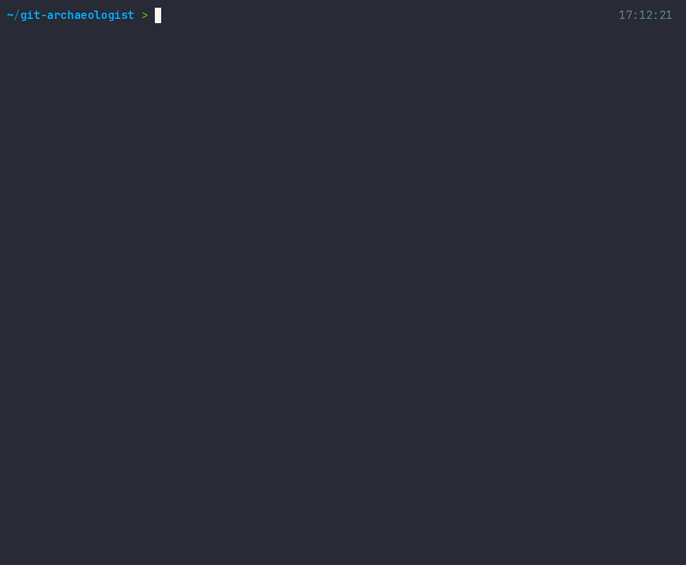

# git-archaeologist




```bash
npm install -g git-archaeologist
```


## The problem

You inherit a codebase. You touch a file. Three things break that you had no idea were connected.

This tool reads your git history and tells you which files are ticking time bombs, who will take an entire module down when they quit, and which files are secretly coupled even though nothing in the code shows it.


## Usage

```bash
git-arch analyze /path/to/repo
git-arch analyze /path/to/repo --html   # saves a shareable report
git-arch cursed --top 10                # just the danger list
git-arch analyze /path/to/repo --json   # pipe into other tools
```


## What it outputs

**Cursed files** - ranked by a score that combines how often a file changes, how many different people touched it, and how recently. A file changed 100 times in 6 months by 15 people scores higher than one changed 200 times over a decade by the same person.

**Bus factor per folder** - not per repo, per folder. The whole repo has bus factor 2 is useless. The lib/ folder is owned by one person is something you can act on.

**Implicit coupling** - pairs of files that always change together in the same commit, even though nothing in the code connects them. These are your hidden dependencies.

**Ownership** - who owns the lines that are alive in HEAD right now. Not who created the file. Not who committed last.


## On Express.js

1716 commits. 230 contributors. 12 years of history.

`lib/response.js` - 128 changes, 53 authors, curse score 2261. The most dangerous file in the codebase and the one most people edit without thinking.

Every module - lib/, test/, examples/, benchmarks/ - has bus factor 1. Douglas Christopher Wilson. If he stops, nobody else fully understands any of it.

`benchmarks/Makefile` and `benchmarks/run` have 100% coupling. Committed together every single time. They are one file.


## The curse score

```
score = changes x log2(authors + 1) x exp(-0.5 x age_in_years) x log2(churn_rate + 2)
```

The exponential decay on age is the key part. A file that was chaotic 5 years ago but stable since does not show up. Only active danger shows up.


## Requirements

Node >= 18, git >= 2.30


## License

MIT